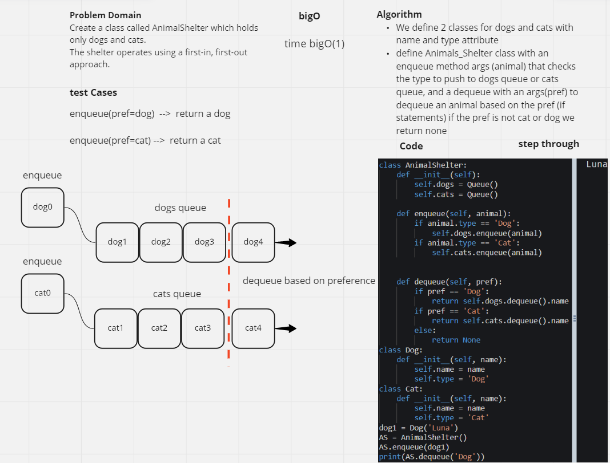
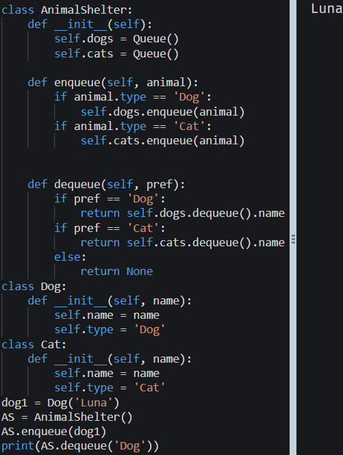

# Challenge Summary
- Create a class called AnimalShelter which holds only dogs and cats.
- The shelter operates using a first-in, first-out approach.
#### Implement the following methods:
- enqueue
```Arguments: animal```
animal can be either a dog or a cat object.
- dequeue
```Arguments: pref```
pref can be either "dog" or "cat"
Return: either a dog or a cat, based on preference.
If pref is not "dog" or "cat" then return null.

## Whiteboard Process


## Approach & Efficiency
#### BigO(1)
We define 2 classes for dogs and cats with name and type attribute
define Animals_Shelter class with an enqueue method args (animal) that checks the type to push to dogs queue or cats queue, and a dequeue with an args(pref) to dequeue an animal based on the pref (if statements) if the pref is not cat or dog we return none

## Solution
