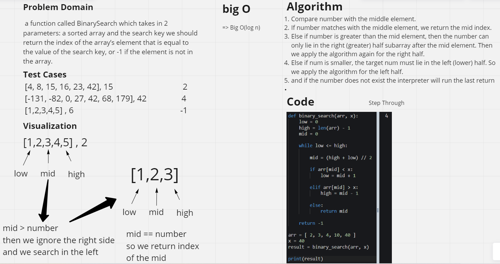

# Binary search
Write a function called BinarySearch which takes in 2 parameters: a sorted array and the search key. Without utilizing any of the built-in methods available to your language, return the index of the array’s element that is equal to the value of the search key, or -1 if the element is not in the array.
## whiteboard Process

## Approach & Efficiency
Compare number with the middle element.
If number matches with the middle element, we return the mid index.
Else if number is greater than the mid element, then the number can only lie in the right (greater) half subarray after the mid element. Then we apply the algorithm again for the right half.
Else if num is smaller, the target num must lie in the left (lower) half. So we apply the algorithm for the left half.
and if the number does not exist the interpreter will run the last return
