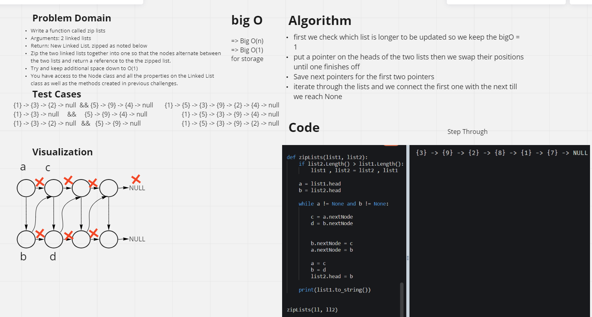
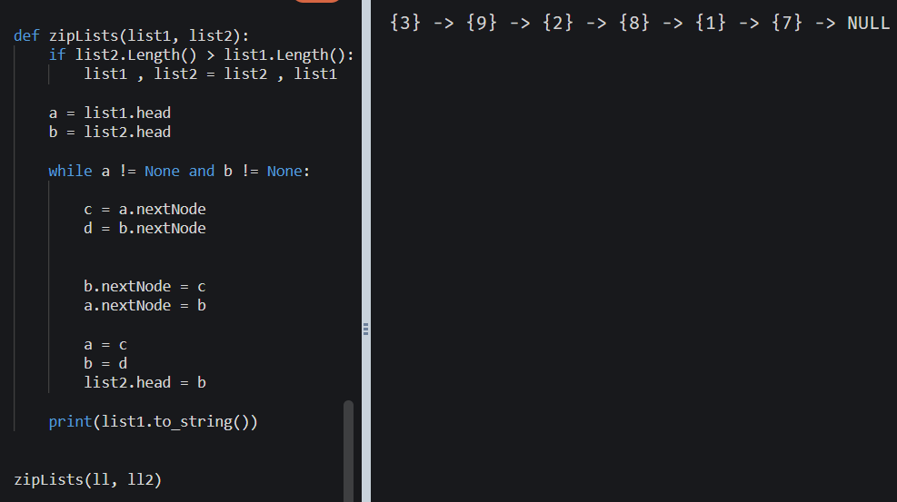

# Challenge Summary
Write a function called zip lists
Arguments: 2 linked lists
Return: New Linked List, zipped as noted below
Zip the two linked lists together into one so that the nodes alternate between the two lists and return a reference to the the zipped list.
Try and keep additional space down to O(1)
You have access to the Node class and all the properties on the Linked List class as well as the methods created in previous challenges.
## Whiteboard Process

## Approach & Efficiency
**bigO(n) for time and bigO(1) for space**

first we check which list is longer to be updated so we keep the bigO = 1
put a pointer on the heads of the two lists then we swap their positions until one finishes off
Save next pointers for the first two pointers
iterate through the lists and we connect the first one with the next till we reach None
## Solution
