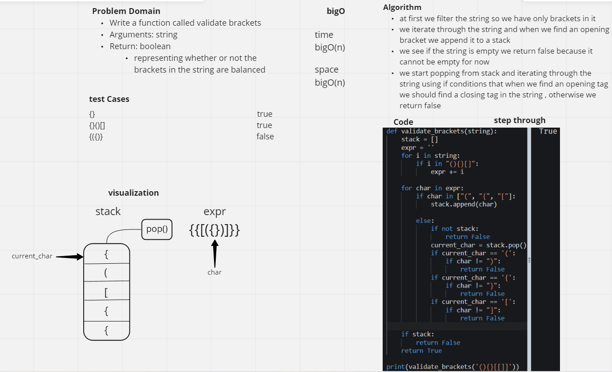
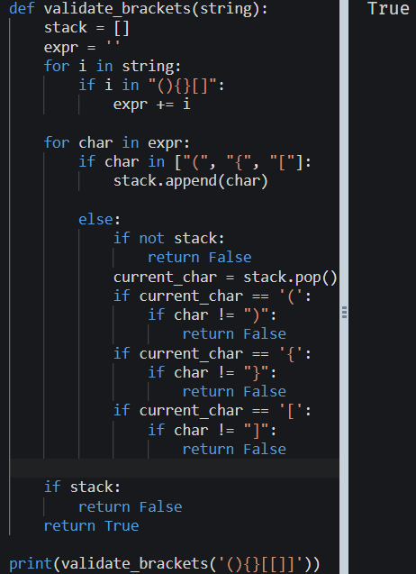

# Challenge Summary
Write a function called validate brackets
Arguments: string
Return: boolean
representing whether or not the brackets in the string are balanced

## Whiteboard Process
<!-- Embedded whiteboard image -->

## Approach & Efficiency
#### bigO (n^2)
at first we filter the string so we have only brackets in it
we iterate through the string and when we find an opening bracket we append it to a stack
we see if the string is empty we return false because it cannot be empty for now
we start popping from stack and iterating through the string using if conditions that when we find an opening tag we should find a closing tag in the string , otherwise we return false

## Solution
