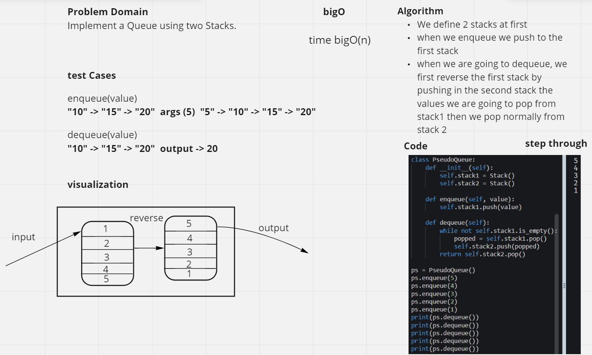
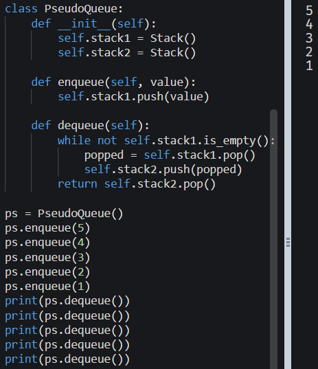

# Challenge Summary
Implement a Queue using two Stacks.

## Whiteboard Process

## Approach & Efficiency
BigO(n)
We define 2 stacks at first
when we enqueue we push to the first stack
when we are going to dequeue, we first reverse the first stack by pushing in the second stack the values we are going to pop from stack1 then we pop normally from stack 2

## Solution
