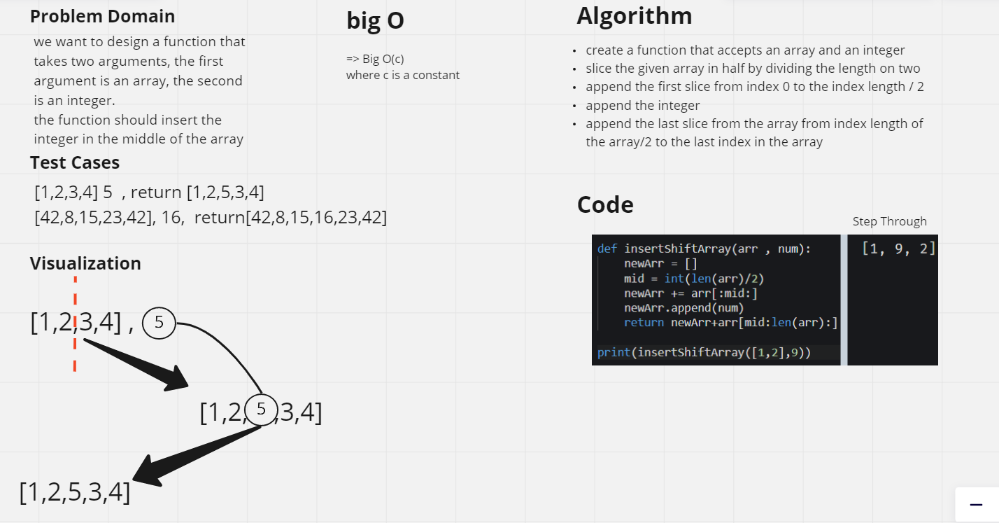

# array insert-shift
Write a function called insertShiftArray which takes in
an array and a value to be added. Without utilizing any
of the built-in methods available to your language,
return an array with the new value added at the
middle index.

## Whiteboard Process

## Approach & Efficiency
We need to insert a number in the middle of a given array,
all of the elements should stay in the same order but the number
should be inserted between them in the middle.
We should initialize a new array so we can add the first part
of the given array sliced from index 0 to the middle, then 
we should append the given element at the last of the initialized
array, and at last, we add the remaining part of the given array
sliced from the middle all the way to the last element.

## time complexity
big O(C) => where c is constant 