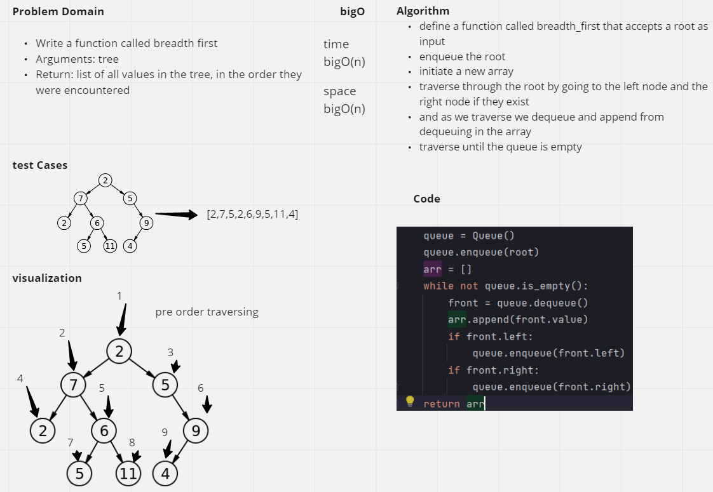
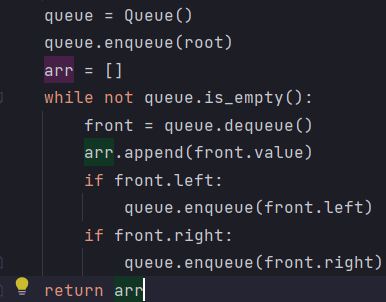

# Challenge Summary
- Write a function called breadth first
- Arguments: tree
- Return: list of all values in the tree, in the order they were encountered

## Whiteboard Process
<!-- Embedded whiteboard image -->

## Approach & Efficiency
<!-- What approach did you take? Why? What is the Big O space/time for this approach? -->
- define a function called breadth_first that accepts a root as input
- enqueue the root
- initiate a new array
- traverse through the root by going to the left node and the right node if they exist
- and as we traverse we dequeue and append from dequeuing in the array
- traverse until the queue is empty
## Solution
<!-- Show how to run your code, and examples of it in action -->
