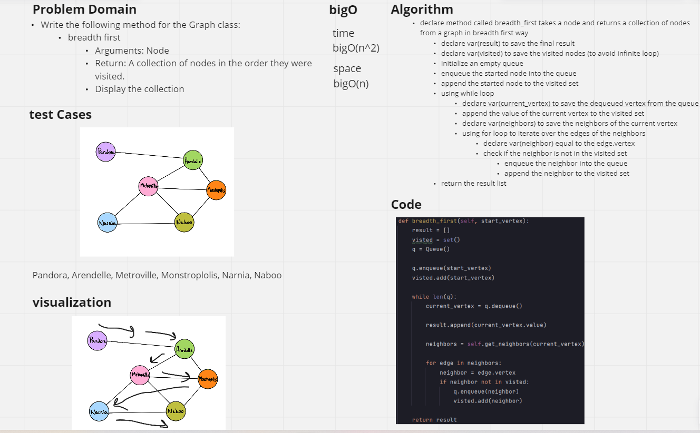

# Code challenge 36: Implement a breadth-first traversal on a graph.  

# Challenge
- Write the following method for the Graph class:
  - breadth first
    - Arguments: Node
    - Return: A collection of nodes in the order they were visited.
    - Display the collection

# Whiteboard Process

# Approach & Efficiency
- Big O Notation for all methods:
  - Time Complexity: O(N^2) Using nested loops 
  - Space Complexity: O(N) create list,Set,Queue in the memory 

# Solution
- declare method called breadth_first takes a node and returns a collection of nodes from a graph in breadth first way 
  - declare var(result) to save the final result 
  - declare var(visited) to save the visited nodes (to avoid infinite loop)
  - initialize an empty queue 
  - enqueue the started node into the queue 
  - append the started node to the visited set
  - using while loop 
    - declare var(current_vertex) to save the dequeued vertex from the queue 
    - append the value of the current vertex to the visited set
    - declare var(neighbors) to save the neighbors of the current vertex
    - using for loop to iterate over the edges of the neighbors 
      - declare var(neighbor) equal to the edge.vertex
      - check if the neighbor is not in the visited set
        - enqueue the neighbor into the queue 
        - append the neighbor to the visited set
  - return the result list 