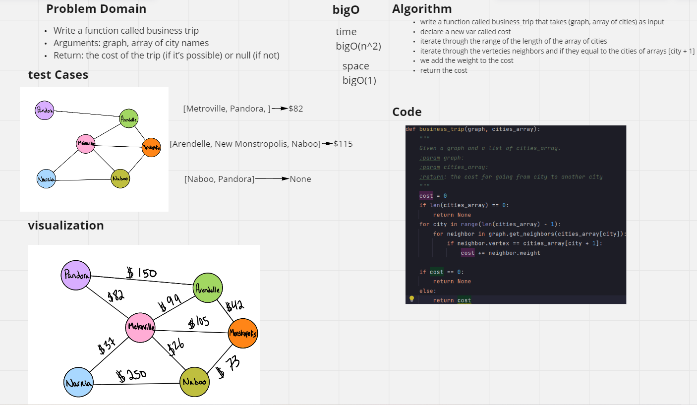
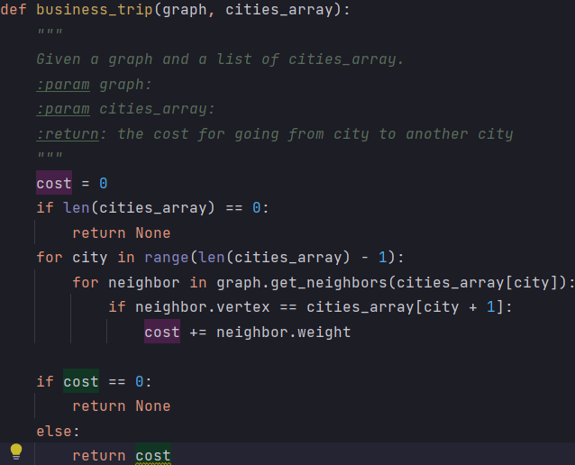

# Challenge Summary
<!-- Description of the challenge -->
- Write a function called business trip
- Arguments: graph, array of city names
- Return: the cost of the trip (if it’s possible) or null (if not)
## Whiteboard Process
<!-- Embedded whiteboard image -->

## Approach & Efficiency
<!-- What approach did you take? Why? What is the Big O space/time for this approach? -->
#### time : bigO(n^2)
#### space : bigO(1)

- write a function called business_trip that takes (graph, array of cities) as input
- declare a new var called cost
- iterate through the range of the length of the array of cities
- iterate through the vertecies neighbors and if they equal to the cities of arrays [city + 1]
- we add the weight to the cost
- return the cost
## Solution
<!-- Show how to run your code, and examples of it in action -->
