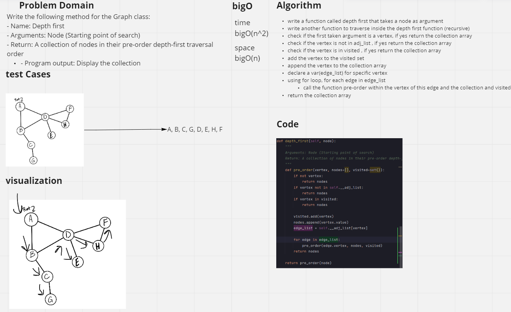

# Depth First Traversal
<!-- Short summary or background information -->

## Challenge
<!-- Description of the challenge -->
Write the following method for the Graph class:

- Name: Depth first
- Arguments: Node (Starting point of search)
- Return: A collection of nodes in their pre-order depth-first traversal order
- Program output: Display the collection
## Approach & Efficiency
<!-- What approach did you take? Why? What is the Big O space/time for this approach? -->
#### Time : bigO(n^2)
#### space : bigO(n)
- write a function called depth first that takes a node as argument
- write another function to traverse inside the depth first function (recursive)
- check if the first taken argument is a vertex, if yes return the collection array
- check if the vertex is not in adj_list , if yes return the collection array
- check if the vertex is in visited , if yes return the collection array
- add the vertex to the visited set
- append the vertex to the collection array
- declare a var(edge_list) for specific vertex
- using for loop, for each edge in edge_list
- call the function pre-order within the vertex of this edge and the collection and visited
- return the collection array
## Tests
Tests : [Depth First Tests](../tests/test_graph_depth_first.py)

actual code : [Graph](../graph.py)

## Solution
<!-- Embedded whiteboard image -->
