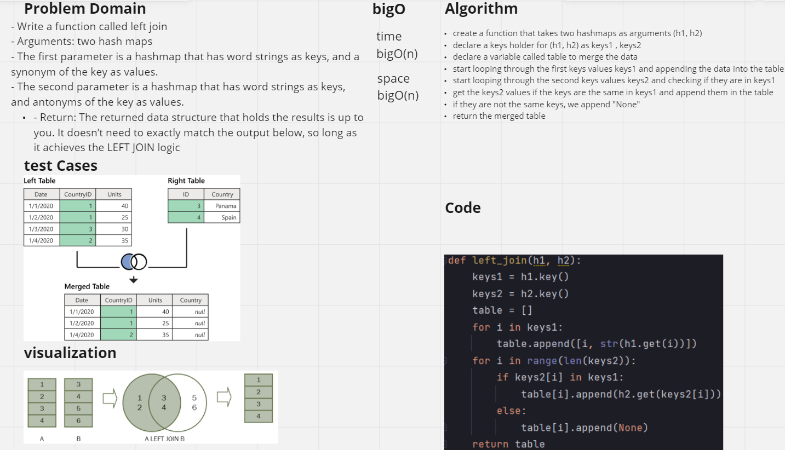
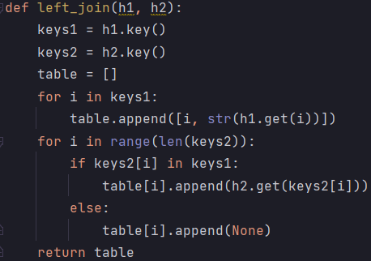

# Challenge Summary
- Write a function called left join
- Arguments: two hash maps
- The first parameter is a hashmap that has word strings as keys, and a synonym of the key as values.
- The second parameter is a hashmap that has word strings as keys, and antonyms of the key as values.
- Return: The returned data structure that holds the results is up to you. It doesn’t need to exactly match the output below, so long as it achieves the LEFT JOIN logic
## Whiteboard Process
<!-- Embedded whiteboard image -->


## Approach & Efficiency
<!-- What approach did you take? Why? What is the Big O space/time for this approach? -->
#### time : BigO(n)
#### space : BigO(n)
- create a function that takes two hashmaps as arguments ```(h1, h2)```
- declare a keys holder for ```(h1, h2)``` as ```keys1 , keys2```
- declare a variable called table to merge the data
- start looping through the first keys values ```keys1``` and appending the data into the table
- start looping through the second keys values ```keys2``` and checking if they are in ```keys1```
- get the ```keys2``` values if the keys are the same in ```keys1``` and append them in the table
- if they are not the same keys, we append "None"
- return the merged table
## Solution
<!-- Show how to run your code, and examples of it in action -->
