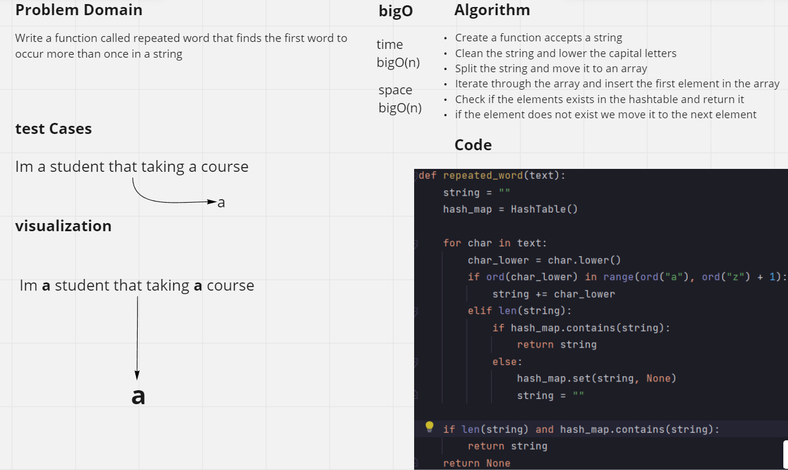
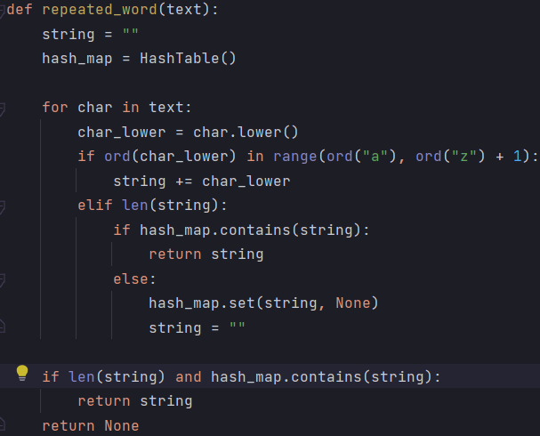

# Challenge Summary
- Write a function called repeated word that finds the first word to occur more than once in a string
- Arguments: string
- Return: string
## Whiteboard Process
<!-- Embedded whiteboard image -->

## Approach & Efficiency
<!-- What approach did you take? Why? What is the Big O space/time for this approach? -->
- Create a function accepts a string
- Clean the string and lower the capital letters
- Split the string and move it to an array
- Iterate through the array and insert the first element in the array
- Check if the elements exists in the hashtable and return it
- if the element does not exist we move it to the next element
## Solution
<!-- Show how to run your code, and examples of it in action -->
