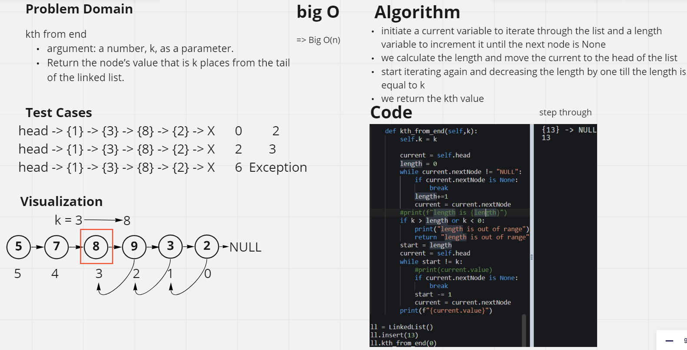

# Challenge Summary
Write the following method for the Linked List class:

kth from end
argument: a number, k, as a parameter.
Return the node’s value that is k places from the tail of the linked list.
You have access to the Node class and all the properties on the Linked List class as well as the methods created in previous challenges.

## Whiteboard Process

## Approach & Efficiency
BigO(n)

initiate a current variable to iterate through the list and a length variable to increment it until the next node is None
we calculate the length and move the current to the head of the list
start iterating again and decreasing the length by one till the length is equal to k
we return the kth value