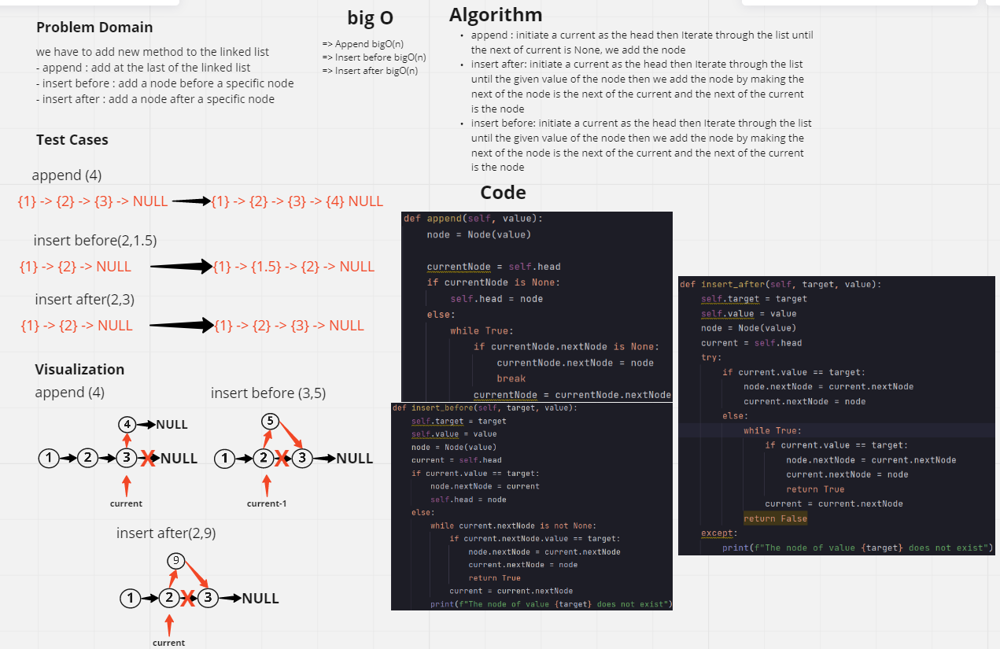
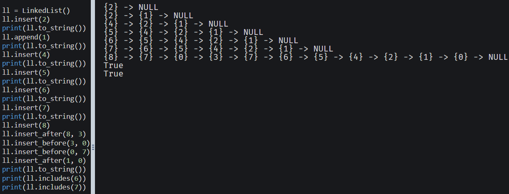

# Challenge Summary
Write the following methods for the Linked List class:

- append
arguments: new value
adds a new node with the given value to the end of the list
- insert before
arguments: value, new value
adds a new node with the given new value immediately before the first node that has the value specified
- insert after
arguments: value, new value
adds a new node with the given new value immediately after the first node that has the value specified

## Whiteboard Process

## Approach & Efficiency
append : bigO(n)
insert before : bigO(n)
insert after : bigO(n)
- append : initiate a current as the head then Iterate through the list until the next of current is None, we add the node
- insert after: initiate a current as the head then Iterate through the list until the given index then we add the node by making the next of the node is the next of the current and the next of the current is the node
- insert before: initiate a current as the head then Iterate through the list until the given index minus one then we add the node by making the next of the node is the next of the current and the next of the current is the node

## Solution

# Singly Linked List
Linked List is a data structure that is made up of multiple nodes
and each node points to the next node the first node
of the list is called the head and the last node points to "NULL"

## Challenge
Node
Create a Node class that has properties for the value stored in the Node, and a pointer to the next Node.
Linked List
Create a Linked List class
Within your Linked List class, include a head property.
Upon instantiation, an empty Linked List should be created.
The class should contain the following methods
insert
Arguments: value
Returns: nothing
Adds a new node with that value to the head of the list with an O(1) Time performance.
includes
Arguments: value
Returns: Boolean
Indicates whether that value exists as a Node’s value somewhere within the list.
to string
Arguments: none
Returns: a string representing all the values in the Linked List, formatted as:
"{ a } -> { b } -> { c } -> NULL"

## Approach & Efficiency
Defining a class called node and a class called linked list
the node class creates a node that points to null
the linked list class with the insert function creates a node by the Node class
and inserts it at the beginning 
the include function returns a boolean, at first it takes the value to be checked and 
it checks the head if it is equal to the value if its not it goes to the next node and if the value if not in the list it returns false

## API
- Insert : takes a value as a parameter and sends it to class Node then insert the node to the first of the lits
- Include : at first it takes the value to be checked and 
it checks the head if it is equal to the value if its not it goes to the next node and if the value if not in the list it returns false
- to_string : represents the nodes of the linked list in an ordered way