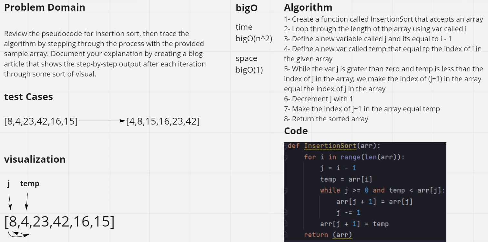
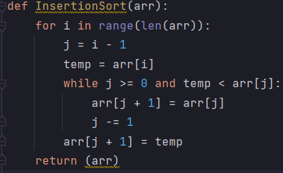

# Challenge Summary
<!-- Description of the challenge -->
## Code Challenge : Class 26
Document your explanation by creating a blog article that shows the step-by-step output after each iteration through some sort of visual.

## Whiteboard Process
<!-- Embedded whiteboard image -->

## Approach & Efficiency
<!-- What approach did you take? Why? What is the Big O space/time for this approach? -->
### BigO :
**Time** bigO(n^2)

**Space** BigO(1)

- Create a function called InsertionSort that accepts an array
- Loop through the length of the array using var called i
- Define a new variable called j and its equal to i - 1
- Define a new var called temp that equal tp the index of i in the given array
- While the var j is grater than zero and temp is less than the index of j in the array; we make the index of (j+1) in the array equal the index of j in the array
- Decrement j with 1
- Make the index of j+1 in the array equal temp
- Return the sorted array
## Solution
<!-- Show how to run your code, and examples of it in action -->
