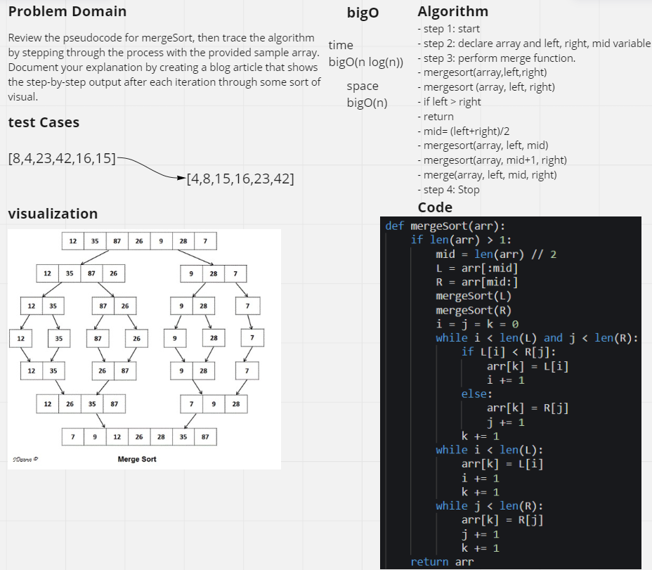
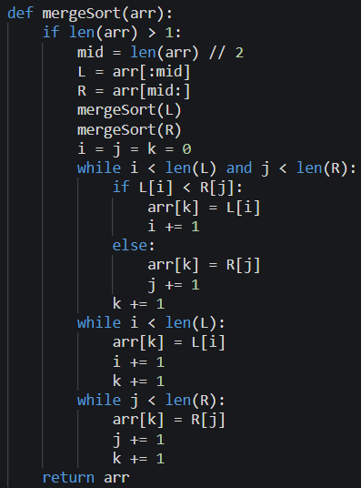

# Challenge Summary
<!-- Description of the challenge -->
## Code Challenge : Class 27
Document your explanation by creating a blog article that shows the step-by-step output after each iteration through some sort of visual.

Once you are done with your article, code a working, tested implementation of Merge Sort based on the pseudocode provided.

## Whiteboard Process
<!-- Embedded whiteboard image -->

## Approach & Efficiency
<!-- What approach did you take? Why? What is the Big O space/time for this approach? -->
### BigO :

**Time** O(n log(n))

**Space** O(n)

- step 1: start
- step 2: declare array and left, right, mid variable 
- step 3: perform merge function.
- mergesort(array,left,right)
- mergesort (array, left, right)
- if left > right
- return
- mid= (left+right)/2
- mergesort(array, left, mid)
- mergesort(array, mid+1, right)
- merge(array, left, mid, right)
- step 4: Stop

## Solution
<!-- Show how to run your code, and examples of it in action -->
