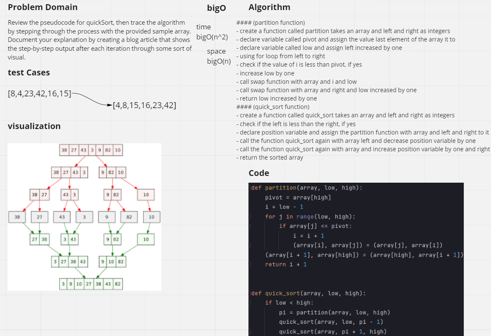
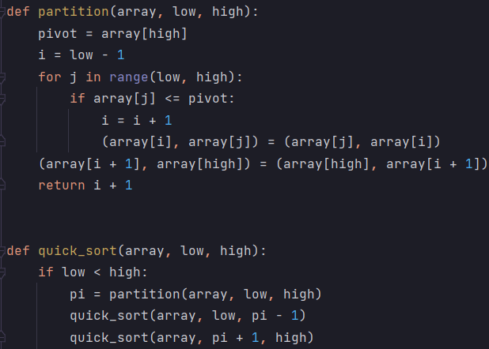

# Challenge Summary
<!-- Description of the challenge -->
## Code Challenge : Class 28
Document your explanation by creating a blog article that shows the step-by-step output after each iteration through some sort of visual.

Once you are done with your article, code a working, tested implementation of Quick Sort based on the pseudocode provided.

## Whiteboard Process
<!-- Embedded whiteboard image -->

## Approach & Efficiency
<!-- What approach did you take? Why? What is the Big O space/time for this approach? -->
### BigO :

**Time** O(n^2)

**Space** O(n)
#### (partition function)

- create a function called partition takes an array and left and right as integers

- declare variable called pivot and assign the value last element of the array it to
- declare variable called low and assign left increased by one
- using for loop from left to right
- check if the value of i is less than pivot, if yes
- increase low by one
- call swap function with array and i and low
- call swap function with array and right and low increased by one
- return low increased by one
#### (quick_sort function)

- create a function called quick_sort takes an array and left and right as integers

- check if the left is less than the right, if yes
- declare position variable and assign the partition function with array and left and right to it
- call the function quick_sort again with array left and decrease position variable by one
- call the function quick_sort again with array and increase position variable by one and right
- return the sorted array

## Solution
<!-- Show how to run your code, and examples of it in action -->
