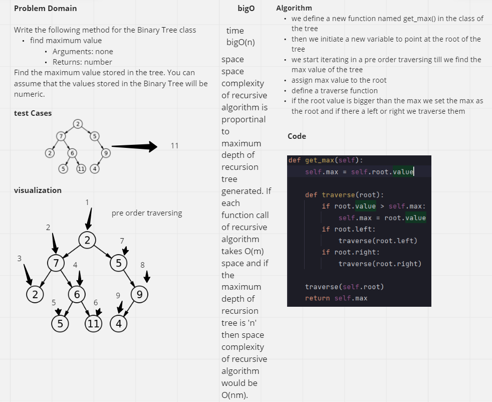
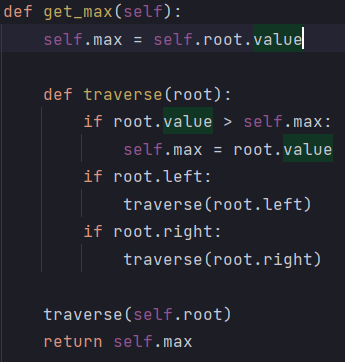
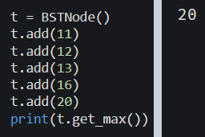

# Challenge Summary
Write the following method for the Binary Tree class

find maximum value
Arguments: none
Returns: number
Find the maximum value stored in the tree. You can assume that the values stored in the Binary Tree will be numeric.
## Whiteboard Process
<!-- Embedded whiteboard image -->

## Approach & Efficiency
<!-- What approach did you take? Why? What is the Big O space/time for this approach? -->
#### time : bigO(n)
#### space : space complexity of recursive algorithm is proportinal to maximum depth of recursion tree generated. If each function call of recursive algorithm takes O(m) space and if the maximum depth of recursion tree is 'n' then space complexity of recursive algorithm would be O(nm).
- Algorithm
we define a new function named get_max() in the class of the tree
then we initiate a new variable to point at the root of the tree
we start iterating in a pre order traversing till we find the max value of the tree
assign max value to the root
define a traverse function
if the root value is bigger than the max we set the max as the root and if there a left or right we traverse them
## Solution
<!-- Show how to run your code, and examples of it in action -->

