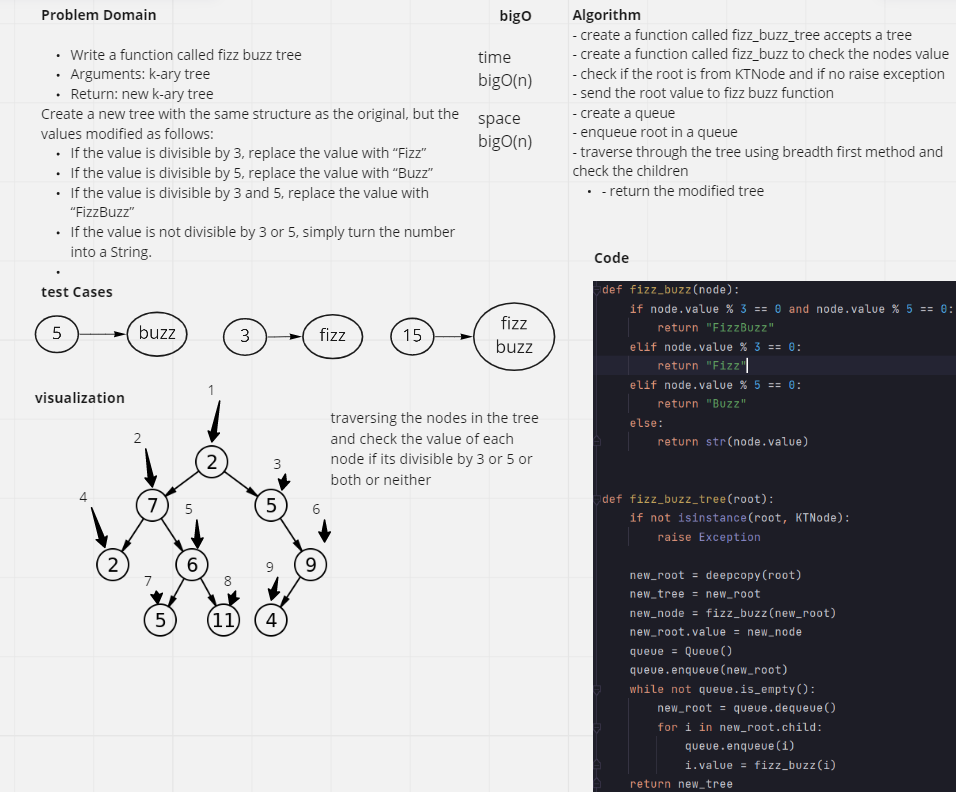
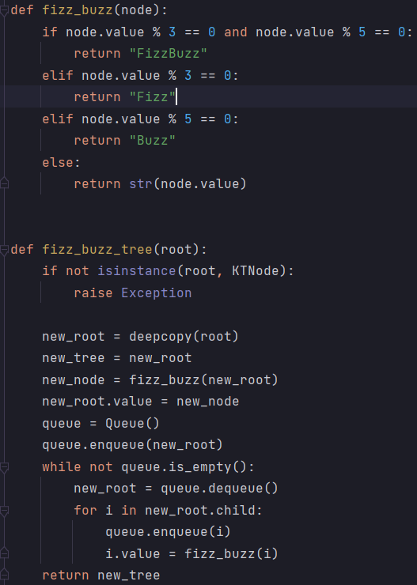

# Code challenge 18 - fizz buzz k array
**Problem Domain**

#### Write a function called fizz buzz tree
- Arguments: k-ary tree
- Return: new k-ary tree
#### Create a new tree with the same structure as the original, but the values modified as follows:
- If the value is divisible by 3, replace the value with “Fizz”
- If the value is divisible by 5, replace the value with “Buzz”
- If the value is divisible by 3 and 5, replace the value with “FizzBuzz”
- If the value is not divisible by 3 or 5, simply turn the number into a String.

## Whiteboard Process

## Approach & Efficiency
#### Time : BigO(n)
#### Space : BigO(n)
- create a function called fizz_buzz_tree accepts a tree
- create a function called fizz_buzz to check the nodes value
- check if the root is from KTNode and if no raise exception
- send the root value to fizz buzz function 
- create a queue
- enqueue root in a queue
- traverse through the tree using breadth first method and check the children
- return the modified tree
## Solution
