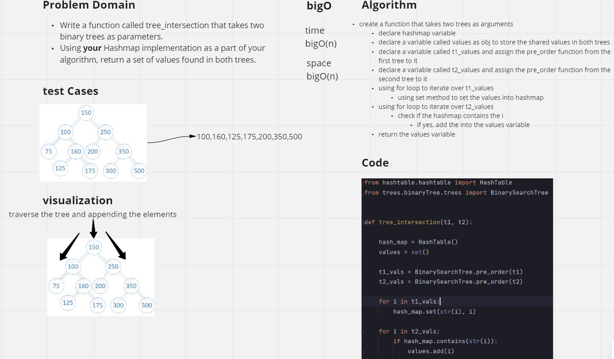
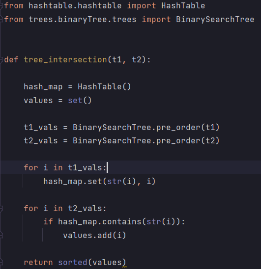

# Challenge Summary
Write a function called tree_intersection that takes two binary trees as parameters.
Using your Hashmap implementation as a part of your algorithm, return a set of values found in both trees.
## Whiteboard Process
<!-- Embedded whiteboard image -->

## Approach & Efficiency
<!-- What approach did you take? Why? What is the Big O space/time for this approach? -->
#### time : BigO(n)
#### space : BigO(n)
- create a function that takes two trees as arguments
- declare hashmap variable
- declare a variable called values as obj to store the shared values in both trees
- declare a variable called t1_values and assign the pre_order function from the first tree to it
- declare a variable called t2_values and assign the pre_order function from the second tree to it
- using for loop to iterate over t1_values
- using set method to set the values into hashmap
- using for loop to iterate over t2_values
- check if the hashmap contains the i
- if yes, add the into the values variable
- return the values variable
## Solution
<!-- Show how to run your code, and examples of it in action -->
